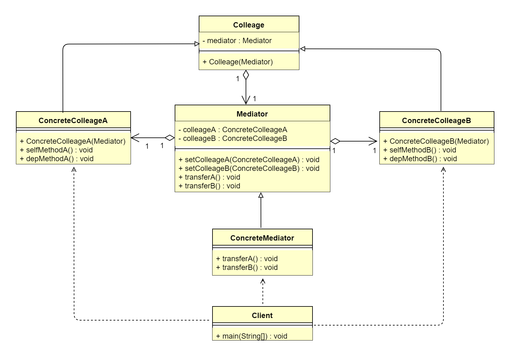

## 1 中介者模式概述
### 1.1 中介者模式的定义
> 中介者模式（Mediator Pattern）又叫作调解者模式或调停者模式。用一个中介对象封装一系列对象交互，中介者使各对象不需要显示地相互作用，从而使其耦合松散，
> 而且可以独立地改变它们之间的交互，属于行为型设计模式。
>  
> **原文**：Define an object that encapsulates how a set of objects interact.Mediator promotes loose coupling by keeping
> objects from referring to each other explicitly, and it lets you vary their interaction independently.
>  
> 中介者模式包装了一系列对象相互作用的方式，使得这些对象不必相互明显作用，从而使它们可以松散耦合。当某些对象之间的作用发生改变时，不会立即影响其他一些
> 对象之间的作用。保证这些作用可以彼此独立地变化。其核心思想是，通过中介者解耦系统各层次对象的直接耦合，层次对象的对外依赖通信全部交由中介者转发。

### 1.2 中介者模式的应用场景
&ensp;&ensp;&ensp;&ensp;在现实生活中，中介者的存在是不可缺少的，如果没有了中介者，我们就不能与远方的朋友进行交流。各个同事对象将会相互进行引用，如果
每个对象都与多个对象进行交互，则会形成网状结构。那么，每个对象之间都过度耦合，这样既不利于信息的复用也不利于扩展。如果引入中介者模式，则对象之间的关系
将变成星形结构。使用中介者模式后，任何一个类的变化，只会影响中介者和类本身，不像之前的设计，任何一个类的变化都会引起其关联的所有类的变化。这样的设计大大
减少了系统的耦合度。 
&ensp;&ensp;&ensp;&ensp;其实日常生活中我们每天刷的朋友圈，就是一个中介者。还有我们所见的信息交易平台，也是中介者模式的体现。中介者模式是用来降低
多个对象和类之间的通信复杂性的。这种模式通过提供一个中介类，将系统各层次对象间的多对多关系变成一对多关系，中介者对象可以将复杂的网络结构变成以中介者为
中心的星形结构，达到降低系统的复杂性、提高可扩展性的作用。若系统各层次对象之间存在大量的关联关系，即层次对象呈复杂的网状结构，如果直接让它们紧耦合通信，
会使系统结构变得异常复杂，且当其中某个层次对象发生改变时，则与其紧耦合的相应层次对象也需进行修改，系统很难进行维护。简单地说，如果多个类相互耦合，形成了
网状结构，则考虑使用中介者模式进行优化。总结一下，中介者模式主要适用于以下应用场景。
*   系统中对象之间存在复杂的引用关系，产生的相互依赖关系结构混乱且难以理解。
*   交互的公共行为，如果需要改变行为，则可以增加新的中介者类。

### 1.3 中介者模式的 UML 类图

 
由上图可以看到，中介者模式主要包含4各角色。
*   抽象中介者（Mediator）：定义统一的接口，用于各个同事角色之间的通信。
*   具体中介者（ConcreteMediator）：从具体的同事对象接收消息，向具体同事对象发出命令，协调同事间的协作。
*   抽象同事类（Colleage）：每一个同事对象均需要依赖中介者角色，与其他同事间通信时，交由中介者进行转发协作。
*   具体同事类（ConcreteColleage）：负责实现自发行为（Self-Method），转发依赖方法（Dep-Method）交由中介者进行协调。

## 2 中介者模式扩展
### 2.1 中介者模式的优点
*   减少类间依赖，将多对多依赖转化成一对多，降低了类间耦合。
*   类间各司其职，符合迪米特法则。

### 2.2 中介者模式的缺点
中介者模式将原本多个对象直接的相互依赖变成了中介者和多个同事类的依赖关系。当同事类越多时，中介者就会越臃肿，变得复杂且难以维护。
