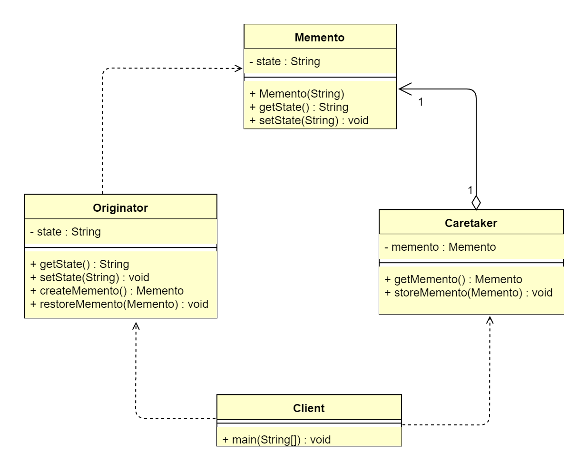

## 1 备忘录模式概述

### 1.1 备忘录模式的定义
> 备忘录模式（Memento Pattern）又叫作快照模式（Snapshot Pattern）或令牌模式（Token Pattern），指在不破坏封装的前提下，捕获一个对象的内部状态，
> 并在对象之外保存这个状态。这样以后就可将该对象恢复到原先保存的状态，属于行为型设计模式。
>  
> **原文**：Without violating encapsulation,capture and externalize an object's internal state so that the object can be
> restored to this state later.
>  
> &ensp;&ensp;&ensp;&ensp;在软件系统中，备忘录模式可以提供一种“后悔药”的机制，它通过存储系统各个历史状态的快照，使得在任一时刻都可以将系统回滚到
> 某一历史状态。备忘录模式的本质是从发起人实体类（Originator）隔离存储功能，降低实体类的职责。同时由于存储信息（Memento）独立，且存储信息的实体交由
> 管理类（Caretaker）管理，则可以通过为管理类扩展额外的功能对存储信息进行扩展操作（比如增加历史快照功能）。
 

### 1.2 备忘录模式的应用场景
&ensp;&ensp;&ensp;&ensp;对于程序员来说，可能天天都在使用备忘录模式，比如我们每天使用的 Git、SVN 都可以提供一种代码版本撤回的功能。还有一个比较
贴切的现实场景就是游戏的存档功能，通过将游戏当前进度存储到本地文件系统或数据库中，使得下次继续游戏时，玩家可以从之前的位置继续进行。备忘录模式主要适用于
以下应用场景。
*   需要保存历史快照的场景。
*   希望在对象之外保存状态，且除了自己，其他类对象无法访问状态保存的具体内容。

### 1.3 备忘录模式的 UML 类图

 
由上图可以看到，备忘录模式主要包含3个角色。
*   发起人角色（Originator）：负责创建一个备忘录，记录自身需要保存的状态；具备状态回滚功能。
*   备忘录角色（Memento）：用于存储 Originator 的内部状态，且可以防止 Originator 以外的对象进行访问。
*   备忘录管理员角色（Caretaker）：负责存储、提供管理 Memento，无法对 Memento 的内容进行操作和访问。

## 2 备忘录模式扩展

### 2.1 备忘录模式的优点
*   简化发起人实体类（Originator）的职责，隔离状态存储与获取，实现了信息的封装，客户端无须关心状态的保存细节。
*   提供状态回滚功能。

### 2.2 备忘录模式的缺点
备忘录模式的缺点主要是消耗资源。如果需要保存的状态过多，则每一次保存都会消耗很多内存。
