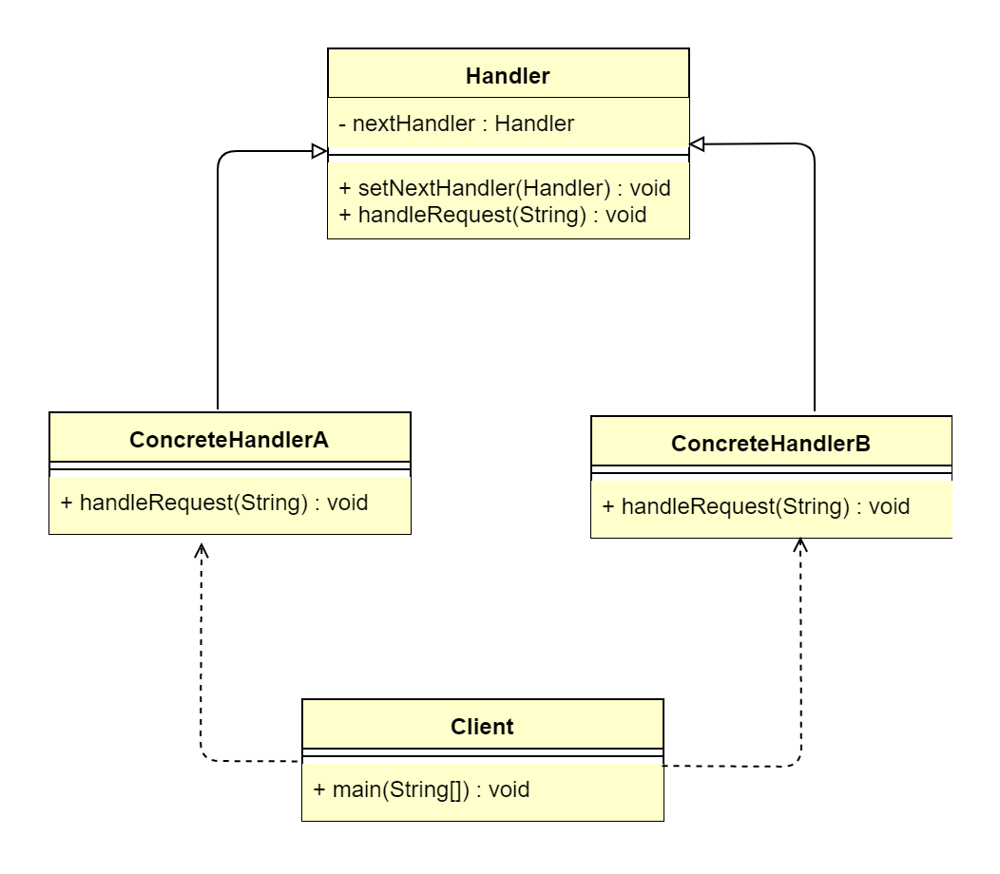

## 1 责任链模式概述
### 1.1 责任链模式的定义
> 责任链模式（Chain of Responsibility Pattern）将链中每一个节点都看作一个对象，每个节点处理的请求均不同，且内部自动维护下一个节点对象。当一个请求
> 从链式的首端发出时，会沿着责任链预设的路径依次传递到每一个节点对象，直至被链中的某个对象处理为止，属于行为型设计模式。
>   
> **原文**：Avoid coupling the sender of a request to its receiver by giving more than one object a chance to handle the request.
> Chain the receiving objects and pass the request along the chain until an object handles it.

### 1.2 责任链模式的应用场景
&ensp;&ensp;&ensp;&ensp;在日常生活中，责任链模式是比较常见的。我们平时处理工作中的一些事务，往往是各部门协同合作来完成某一个任务的。而每个部门都有
各自的职责，因此，很多时候事情完成一半，便会转交到下一个部门，直到所有部门都审批通过，事情才能完成。还有我们平时说的"过五关，斩六将"其实就是闯关，也是
责任链模式的一种应用场景。责任链模式主要解耦了请求与处理，客户只需将请求发送到链上即可，不需要关心请求的具体内容和处理细节，请求会自动进行传递，直至有节点
对象进行处理。责任链模式主要适用于以下应用场景。
*   多个对象可以处理同一请求，但具体由哪个对象处理则在运行时动态决定。
*   在不明确指定接收者的情况下，向多个对象中的一个提交请求。
*   可动态指定一组对象处理请求。

### 1.3 责任链模式的 UML 类图

 
由上图可以看到，责任链模式主要包含2个角色。
*   抽象处理者（Handler）：定义一个请求处理的方法，并维护一个下一处理节点 Handler 对象的引用。
*   具体处理者（ConcreteHandler）：对请求进行处理，如果不感兴趣，则进行转发。

 
&ensp;&ensp;&ensp;&ensp;责任链模式的本质是解耦请求与处理，让请求在处理链中能进行传递与被处理；理解责任链模式应当理解的是其模式（道）而不是其具体
实现（术），责任链模式的独到之处是其将节点处理者组合成了链式结构，并允许节点自身决定是否进行请求处理或转发，相当于让请求流动起来。

## 2 责任链模式扩展
### 2.1 责任链模式的优点
*   将请求与处理解耦。
*   请求处理者（节点对象）只需关注自己感兴趣的请求进行处理即可，对于不感兴趣的请求，直接转发给下一个节点对象。
*   具备链式传递处理请求功能，请求发送者不需要知晓链路结构，只需等待请求处理结果即可。
*   链路结构灵活，可以通过改变链路结构动态地新增或删减责任。
*   易于扩展新的请求处理类（节点），符合开闭原则。
### 2.2 责任链模式的缺点
*   责任链太长或者处理时间过长，会影响整体性能。
*   如果节点对象存在循环引用，则会造成死循环，导致系统崩溃。
