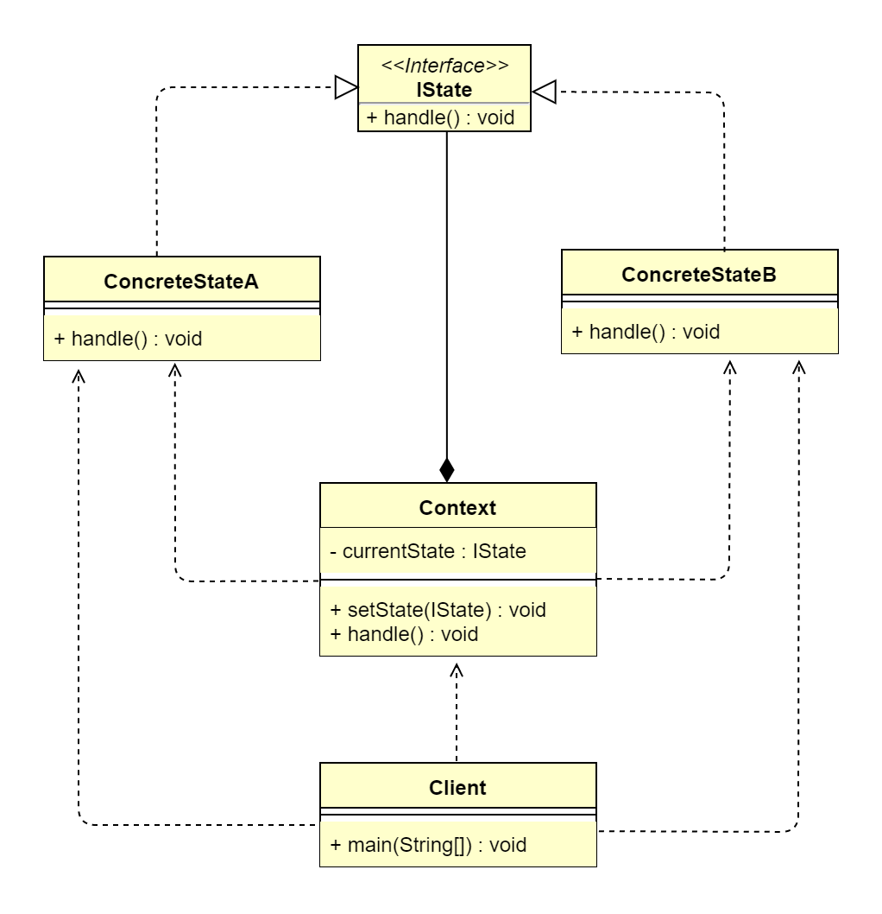

## 1 状态模式概述
### 1.1 状态模式的定义
> 状态模式（State Pattern）也叫作状态机模式（State Machine Pattern），允许对象在内部状态发生改变时改变它的行为，对象看起来好像修改了它的类，属于
> 行为型设计模式。
>   
> **原文**：Allow an object to alter its behavior when its internal state changes. The object will appear to change its class.
>   
> 状态模式中类的行为是由状态决定的，在不同的状态下有不同的行为。其意图是让一个对象在其内部改变的时候，行为也随之改变。状态模式的核心是状态与行为绑定，
> 不同的状态对应不同的行为。

### 1.2 状态模式的应用场景
&ensp;&ensp;&ensp;&ensp;状态模式在生活中比较常见。例如，我们平时网购的订单状态变化。另外，我们平时坐电梯时电梯的状态变化。在软件开发过程中，对于
某一项操作，可能存在不同的情况。通常处理多情况的问题最直接的方式就是使用if...else或switch...case条件语句进行枚举。但是这种做法对于复杂状态的判断存在
天然弊端：条件判断语句过于臃肿，可读性差，且不具备扩展性，维护难度也大。而如果转换思维，将这些不同状态独立起来，用各个不同的类进行表示，系统处于哪种情况，
直接使用相应的状态类对象进行处理，消除了if...else、switch...case等冗余语句，代码更有层次性，并且具备良好的扩展性。状态模式主要解决的就是控制一个
对象状态的条件表达式过于复杂时的情况。通过把状态的判断逻辑转移到表示不同状态的一系列类中，可以把复杂的判断逻辑简化。对象的行为依赖它的状态（属性），并且
行为会随着它的状态改变而改变。状态模式主要适用于以下应用场景。
*   行为随状态改变而改变的场景。
*   一个操作中含有庞大的多分支结构，并且这些分支取决于对象的状态。

### 1.3 状态模式的 UML 类图

 
由上图可以看到，状态模式主要包含3个角色。
*   环境类角色（Context）：定义客户端需要的接口，内部维护一个当前状态实例，并负责具体状态的切换。
*   抽象状态角色（IState）：定义该状态下的行为，可以有一个或多个行为。
*   具体状态角色（ConcreteState）：具体实现该状态对应的行为，并且在需要的情况下进行状态切换。

## 2 状态模式扩展
### 2.1 状态模式与责任链模式的区别
&ensp;&ensp;&ensp;&ensp;状态模式和责任链模式都能消除 if...else 分支过多的问题。但在某些情况下，状态模式中的状态可以理解为责任，那么在这种情况下，
两种模式都可以使用。从定义来看，状态模式强调的是一个对象内在状态的改变，而责任链模式强调的是外部节点对象间的改变。从代码实现上来看，两者最大的区别就是
状态模式的各个状态知道自己要进入的下一个状态对象，而责任链模式并不清楚其下一个节点处理对象，因为链式组装由客户端负责。

### 2.2 状态模式与策略模式的区别
&ensp;&ensp;&ensp;&ensp;状态模式和策略模式的 UML 类图架构几乎完全一样，但两者的应用场景是不一样的。策略模式的多种算法行为择其一都能满足，彼此之间
是独立的，用户可自行更换策略算法；而状态模式的各个状态间存在相互关系，彼此之间在一定条件下存在自动切换状态的效果，并且用户无法指定状态，只能设置初始状态。

### 2.3 状态模式的优点
*   结构清晰：将状态独立为类，消除了冗余的 if...else 或 switch...case 语句，使代码更加简洁，提高了系统的可维护性。
*   将状态转换显示化：通常对象内部都是使用数值类型来定义状态的，状态的切换通过赋值进行表现，不够直观；而使用状态类，当切换状态时，是以不同的类进行表示的，
    转换目的更加明确。
*   状态类职责明确且具备扩展性。

### 2.4 状态模式的缺点
*   类膨胀：如果一个事物具备很多状态，则会造成状态类太多。
*   状态模式的结构与实现都较为复杂，如果使用不当，将导致程序结构和代码的混乱。
*   状态模式对开闭原则的支持并不太好，对于可以切换状态的状态模式，增加新的状态类需要修改那些负责状态转换的源码，否则无法切换到新增状态，而且修改某个
    状态类的行为也需要修改对应类的源码。
