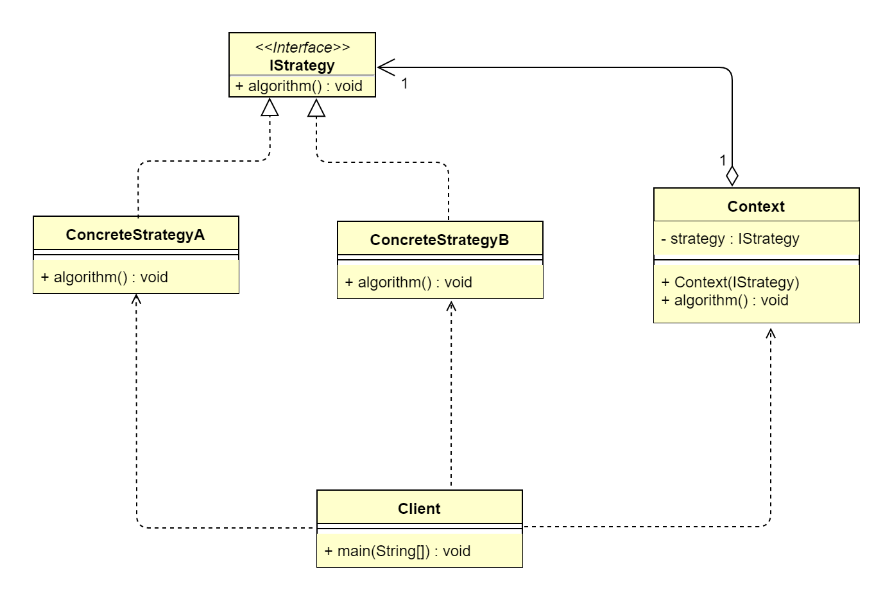

## 1 策略模式概述
### 1.1 策略模式的定义
> 策略模式（Strategy Pattern）又叫作政策模式（Policy Pattern），它将定义的算法家族分别封装起来，让它们之间可以互相替换，从而让算法的变化不会影响
> 到使用算法的用户，属于行为型设计模式。
>   
> **原文**：Define a family of algorithms, encapsulate each one, and make them interchangeable.
>   
> 策略模式使用的就是面向对象的继承和多态机制，从而实现同一行为在不同的场景下具备不同的实现。

### 1.2 策略模式的应用场景
&ensp;&ensp;&ensp;&ensp;策略模式在生活场景中的应用非常多。比如，一个人的纳税比率与他的工资有关，不同的工资水平对应不同的税率。再比如，在互联网移动
支付的大背景下，我们每次下单后付款前，都需要选择支付方式（银联支付、微信支付、支付宝支付）。策略模式可以解决在有多种相似算法的情况下使用 if...else 或
switch...case 所带来的复杂性和臃肿性问题。在日常业务开发中，策略模式适用于以下应用场景。
*   针对同一类型问题，有多种处理方式，每一种都能独立解决问题。
*   需要自由切换算法的场景。
*   需要屏蔽算法规则的场景。

### 1.3 策略模式的 UML 类图

 
由上图可以看到，策略模式主要包含3个角色。
*   上下文角色（Context）：用来操作策略的上下文环境，屏蔽高层模块（客户端）对策略、算法的直接访问，封装可能存在的变化。
*   抽象策略角色（IStrategy）：规定策略或算法的行为。
*   具体策略角色（ConcreteStrategy）：具体的策略或算法实现。
>**注意**：策略模式中的上下文角色（Context），其职责是隔离客户端与策略类的耦合，让客户端完全与上下文角色沟通，不需要关心具体策略。

## 2 策略模式扩展
### 2.1 策略模式的优点
*   策略模式符合开闭原则。
*   避免使用多重条件转移语句，如 if...else 语句、switch...case 语句。
*   使用策略模式可以提高算法的保密性和安全性。
### 2.2 策略模式的缺点
*   客户端必须知道所有的策略，并且自行决定使用哪一个策略类。
*   代码中会产生非常多策略类，增加维护难度。
