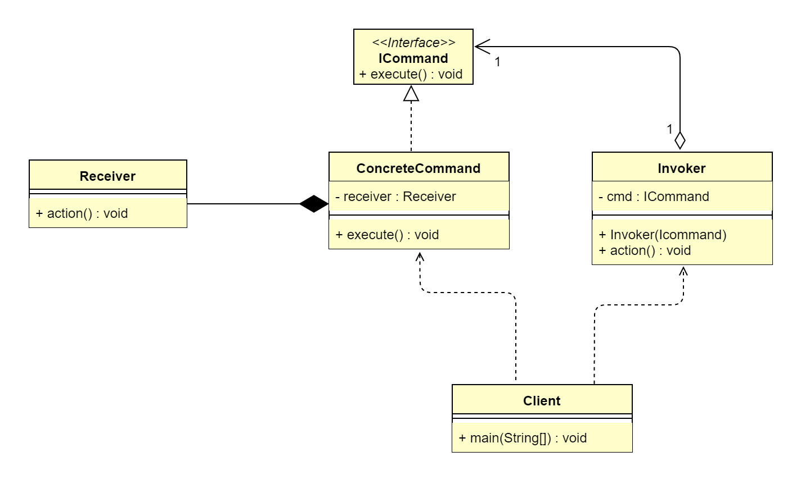

## 1. 命令模式概述
### 1.1 命令模式的定义
>命令模式（Command Pattern）是对命令的封装，每一个命令都是一个操作：请求方发出请求要求执行一个操作；接收方收到请求，并执行操作。命令模式解耦了请求
>方和接收方，请求方只需请求执行命令，不用关心命令怎样被接收、怎样被操作及是否被执行等。命令模式属于行为型设计模式。
>  
> **原文**：Encapsulate a request as an object, thereby letting you parameterize clients with different requests，queue or 
> log request,and support undoable operations.

&ensp;&ensp;&ensp;&ensp;在软件系统中，行为请求者与行为实现者通常是一种紧耦合关系，因为这样的实现简单明了。但紧耦合关系缺乏扩展性，在某些场合，当
需要对行为进行记录、撤销或重做等处理时，只能修改源码。而命令模式通过在请求与实现间引入一个抽象命令接口，解耦了请求与实现，并且中间件是抽象的，它由不同的
子类实现，因此具备扩展性。所以，命令模式的本质是解耦命令请求与处理。

### 1.2 命令模式的应用场景
&ensp;&ensp;&ensp;&ensp;当系统的某项操作具备命令语义，且命令实现不稳定时，可以通过命令模式解耦请求与实现，使用抽象命令接口使请求方的代码架构稳定，
封装接收方具体命令的实现细节。接收方与抽象命令接口呈现弱耦合（内部方法无须一致），具备良好的扩展性。命令模式主要适用于以下应用场景。
*   现实语义中具备“命令”的操作（如命令菜单、Shell命令等）
*   请求的调用者和接收者需要解耦，使得调用者和接收者不直接交互。
*   需要抽象出等待执行的行为，比如撤销（Undo）操作和恢复（Redo）等操作。
*   需要支持命令宏（即命令组合操作）。

### 1.3 命令模式的 UML 类图

 
由上图可以看到，命令模式主要包含4个角色。
*   接收者角色（Receiver）：该类负责具体实施或执行一个请求。
*   命令角色（ICommand）：定义需要执行的所有命令行为。
*   具体命令角色（ConcreteCommand）：该类内部维护一个Receiver，在其execute()方法中调用Receiver的相关方法。
*   请求者角色（Invoker）：接收客户端的命令，并执行命令。

从命令模式的UML类图中，其实可以很清晰地看出：ICommand的出现就是作为Receiver和Invoker的中间件，解耦了彼此。而之所以引入Icommand中间件，是以下两
方面原因。
*   解耦请求与实现：即解耦了Invoker和Receiver，因为在 UML 类图中，Invoker 是一个具体的实现，等待接收客户端传入的命令（即Invoker与客户端耦合），
    Invoker 处于业务逻辑区域，应当是一个稳定的结构。而Receiver属于业务功能模块，是经常变动的；如果没有 ICommand，则 Invoker 紧耦合 Receiver，
    一个稳定的结构依赖一个不稳定的结构，就会导致整个结构都不稳定。这就是引入 ICommand 的原因：不仅仅是解耦请求与实现，同时稳定（Invoker）依赖稳定
    （ICommand），结构还是稳定的。
*   增强扩展性：扩展性又体现在以下两个方面。
    -   Receiver 属于底层细节，可以通过更换不同的 Receiver 达到不同的细节实现。
    -   ICommand 接口本身就是抽象的，具备扩展性；而且由于命令对象本身具备抽象性，如果结合装饰器模式，则功能扩展简直如鱼得水。
> **注**：在一个系统中，不同的命令对应不同的请求，也就是说无法把请求抽象化，因此命令模式中的 Invoker 是具体实现；但是如果在某一个模块中，可以对 
> Invoker 进行抽象，其实这就变相使用到了桥接模式(ICommand类具备两个变化的维度；Invoker 和 Receiver)，这样扩展性会更加优秀。

## 2. 命令模式扩展
### 2.1 命令模式的优点
*   通过引入中间件（抽象接口），解耦了命令请求与实现。
*   扩展性良好，可以很容易地增加新命令。
*   支持组合命令，支持命令队列。
*   可以在现有命令的基础上，增加额外功能。比如日志记录，结合装饰器模式会更加灵活。

### 2.2 命令模式的缺点
*   具体命令类可能过多。
*   命令模式的结果其实就是接收方的执行结果，但是为了以命令的形式进行架构、解耦请求与实现，引入了额外类型结构（引入了请求方与抽象命令接口），增加了理解
    上的困难。不过这也是设计模式的通病，抽象必然会额外增加类的数量；代码抽离肯定比代码聚合更难理解。
