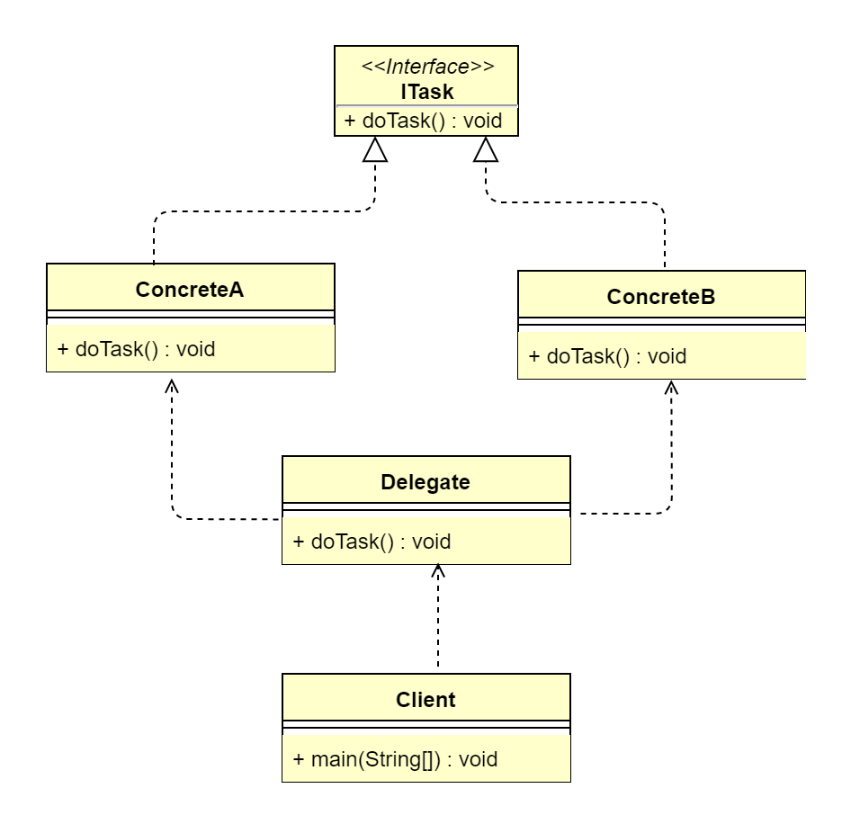

## 1. 委派模式概述
### 1.1 委派模式的定义
> 委派模式（Delegate Pattern）又叫作委托模式，是一种面向对象的设计模式，允许对象组合实现与继承相同的代码重用。它的基本作用就是负责任务的调用和分配，
> 是一种特殊的静态代理模式，可以理解为全权代理模式，但是代理模式注重过程，而委派模式注重结果。委派模式属于行为型设计模式，不属于 GoF 的 23 种设计模式。

### 1.2 委派模式的应用场景
委派模式适用于以下应用场景。
*   需要实现表现层和业务层之间的松耦合。
*   需要编排多个服务之间的调用。
*   需要封装一层服务查找和调用。

### 1.3 委派模式的 UML 类图

 
由上图可以看到，委派模式有3个参与角色。
*   抽象任务角色（ITask）：定义一个抽象接口，它有若干实现类。
*   委派者角色（Delegate）：负责各个具体角色实例之间做出决策，判断并调用具体实现的方法。
*   具体任务角色（Concrete）：真正执行任务的角色。

## 2. 委派模式扩展
### 2.1 委派模式的优点
通过任务委派能够将一个大型任务细化，然后通过统一管理这些子任务的完成情况实现任务的跟进，加快任务执行的效率。
### 2.2 委派模式的缺点
任务委派方式需要根据任务的复杂程度进行不同的改变，在任务比较复杂的情况下，可能需要进行多重委派，容易造成紊乱。
