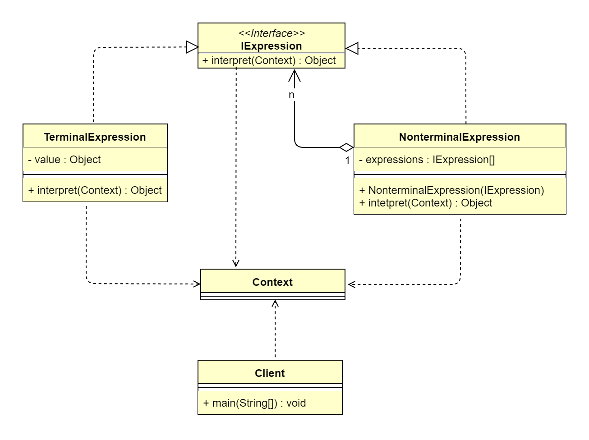

## 1 解释器模式概述
### 1.1 解释器模式的定义
> 解释器模式（Interpreter Pattern）指给定一门语言，定义它的文法的一种表示，并定义一个解释器，该解释器使用该表示来解释语言中的句子。解释器模式是一种
> 按照规定的文法（语法）进行解析的模式，属于行为型设计模式。
>  
> **原文**：Given a language,define a representation for its grammar along with an interpreter that uses the representation 
> to interpret sentences in the language.
>  
> &ensp;&ensp;&ensp;&ensp;就比如编译器可以将源码编译解释为机器码，让 CPU 能进行识别并运行。解释器模式的作用其实与编译器一样，都是将一些固定的文法
> （语法）进行解释，构建出一个解释句子的解释器。简单理解，解释器是一个简单文法分析工具，它可以识别句子语义，分离终结符号和非终结符号，提取出需要的信息，
> 让我们能针对不同的信息做出相应的处理。其核心思想是识别文法，构建解释。

### 1.2 解释器模式的应用场景
&ensp;&ensp;&ensp;&ensp;其实，我们每天都生活在解释器模式中，我们平时听到的音乐都可以通过简谱记录下来；还有战争年代发明的摩尔斯电码（Morse code，
又译为摩斯密码），其实也是一种解释器。在程序中，如果存在一种特定类型的问题，该类型问题涉及多个不同实例，但是具备固定文法描述，则可以使用解释器模式对该类型
问题进行解释，分离出需要的信息，根据获取的信息做出相应的处理。简而言之，对于一些固定文法，构建一个特定的解释器。解释器模式主要适用于以下应用场景。
*   一些重复出现的问题可以用一种简单的语言进行表达。
*   一个简单语法需要解释的场景。

### 1.3 解释器模式的 UML 类图

 
由上图可以看到，解释器模式主要包含4个角色。
*   抽象表达式（IExpression）：负责定义一个解释方法 interpret，交由具体子类进行具体解释。
*   终结符表达式（TerminalExpression）：实现文法中与终结符有关的解释操作。文法中的每一个终结符都有一个具体终结表达式与之相对应，比如公式 R=R1+R2，
    R1 和 R2 就是终结符，对应的解析 R1 和 R2 的解析器就是终结符表达式。通常一个解析器模式中只有一个终结符表达式，但有多个实例，对应不同的终结符（如R1、R2）。
*   非终结符表达式（NonterminalExpression）：实现文法中与非终结符有关的解释操作。文法中的每条规则都对应一个非终结符表达式。非终结符表达式一般是
    文法中的运算符或者其他关键字，比如在公式 R=R1+R2中，“+”就是非终结符，解析“+”的解析器就是一个非终结符表达式。非终结符表达式根据逻辑的复杂程度而
    增加，原则上每个文法规则都对应一个非终结符表达式。
*   上下文环境类（Context）：包含解析器之外的全局信息。它一般用来存放文法中各个终结符所对应的具体值，比如 R=R1+R2，给 R1 赋值100，给R2赋值200，
    这些信息需要被存放到环境中。

## 2 解释器模式扩展
### 2.1 解释器模式的优点
*   在解释器模式中，由于语法是由很多类表示的，当语法规则更改时，只需修改相应的非终结符表达式即可；当扩展语法时，只需添加相应的非终结符类即可。
*   增加了新的解释表达式的方式。
*   解释器模式对应的文法应当是比较简单且易于实现的，过于复杂的语法并不适合使用解释器模式。

### 2.2 解释器模式的缺点
*   解释器模式的每个语法都要产生一个非终结符表达式，当语法规则比较复杂时，就会产生大量解释类，引起类膨胀，增加系统维护的难度。
*   解释器模式采用递归调用方法，每个非终结符表达式都只关心与自己有关的表达式，每个表达式都需要知道最终的结果，因此完整表达式的最终结果是通过从后往前递归
    调用的方式获取的。当完整表达式层次较深时，解释效率下降，且出错时调试困难，因为递归迭代的层次太深。
