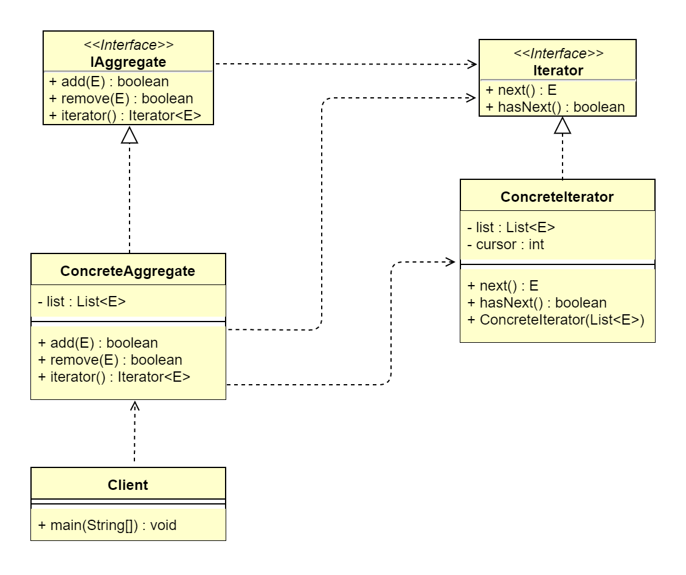

## 1. 迭代器模式概述
### 1.1 迭代器模式的定义
> 迭代器模式（Iterator Pattern）又叫作游标模式（Cursor Pattern），它提供一种按顺序访问集合/容器对象元素的方法，而又无须暴露集合内部表示。迭代器
> 模式可以为不同的容器提供一致的遍历行为，而不用关心容器内元素的组成结构，属于行为型设计模式。
>   
> **原文**：Provide a way to access the elements of an aggregate object sequentially without exposing its underlying respresentation.
>   
> 迭代器模式的本质是把集合对象的迭代行为抽离到迭代器中，提供一致的访问接口。
 
### 1.2 迭代器模式的应用场景
&ensp;&ensp;&ensp;&ensp;迭代器模式在生活中应用得比较广泛。比如，物流系统中的传送带，不管传送的是什么物品，都被打包成一个个箱子，并且有一个统一的
二维码。这样我们不需要关心箱子里是什么，在分发时只需要一个个检查发送的目的地即可。再比如，我们平时乘坐交通工具，都是统一刷卡或者刷脸进站，而不需要关心
是男性还是女性、是残疾人还是正常人等信息。
&ensp;&ensp;&ensp;&ensp;我们把多个对象聚在一起形成的总体称为集合（Aggregate），集合对象是能够包容一组对象的容器对象。不同的集合其内部元素的聚合
结构可能不同，而迭代器模式屏蔽了内部元素的获取细节，为外部提供一致的元素访问行为，解耦了元素迭代与集合对象间的耦合，并且通过提供不同的迭代器，可以为同
一个集合对象提供不同顺序的元素访问行为，扩展了集合对象元素迭代功能，符合开闭原则。迭代器模式适用于以下应用场景。
*   访问一个集合对象的内容而无须暴露它的内部表示。
*   为遍历不同的集合结构提供一个统一的访问接口。

### 1.3 迭代器模式的 UML 类图

 
由上图可以看到，迭代器模式主要包含4个角色。
*   抽象迭代器（Iterator）：抽象迭代器负责定义访问和遍历元素的接口。
*   具体迭代器（ConcreteIterator）：提供具体的元素遍历行为。
*   抽象容器（IAggregate）：负责定义提供具体容器的接口。
*   具体容器（ConcreteAggregate）：创建具体容器。

## 2. 迭代器模式扩展
### 2.1 迭代器模式的优点
*   多态迭代：为不同的聚合结构提供一致的遍历接口，即一个迭代接口可以访问不同的集合对象。
*   简化集合对象接口：迭代器模式将集合对象本身应该提供的元素迭代接口抽取到迭代器中，使集合对象无须关心具体迭代行为。
*   元素迭代功能多样化：每个集合对象都可以提供一个或多个不同的迭代器，使得同种元素的聚合结构可以有不同的迭代行为。
*   解耦迭代与集合：迭代器模式封装了具体的迭代算法，迭代算法的变化不会影响到集合对象的架构。

### 2.2 迭代器模式的缺点
&ensp;&ensp;&ensp;&ensp;对于比较简单的遍历（如数组或者有序列表），使用迭代器模式遍历较为繁琐。在日常开发中，我们几乎不会自己写迭代器。除非需要定制
一个自己实现的数据结构对应的迭代器，否则，开源框架提供的 API 完全够用。
