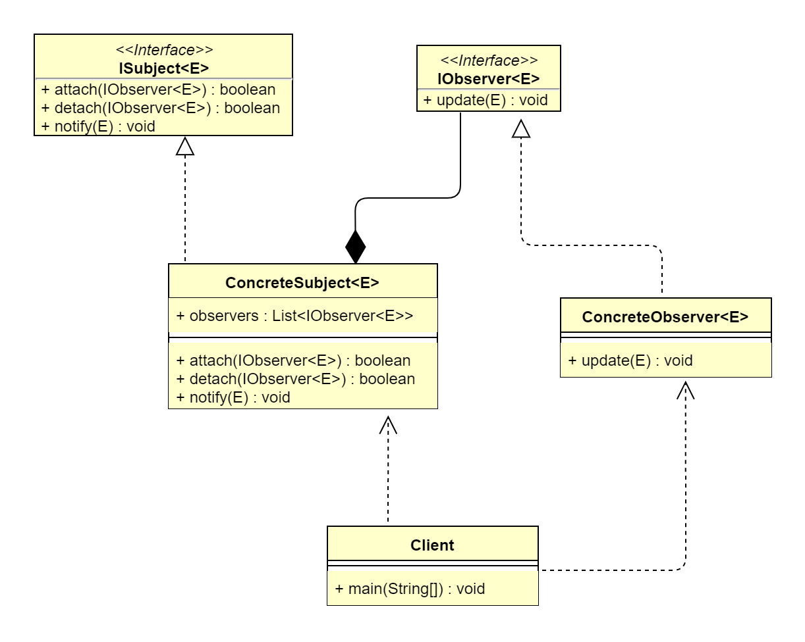

## 1. 观察者模式概述
### 1.1 观察者模式的定义
>&ensp;&ensp;&ensp;&ensp;观察者模式（Observer Pattern）又叫作发布-订阅（Publish/Subscribe）模式、模型-视图（Model/View）模式、源-监听器
> （Source/Listener）模式或从属者（Dependent）模式。定义一种一对多的依赖关系，一个主题对象可被多个观察者对象监听，使得每当主题对象状态变化时，所有
> 依赖它的对象都会得到通知并被自动更新，属于行为型设计模式。
>   
> **原文**：Defines a one-to-many dependency relationship between objects so that each time an object's state changes, its
> dependent objects are notified and automatically updated.
>   
> 观察者模式的核心是将观察者与被观察者解耦，以类似消息/广播发送的机制联动两者，使被观察者的变动能通知到感兴趣的观察者们，从而做出相应的响应。

### 1.2 观察者模式的应用场景
&ensp;&ensp;&ensp;&ensp;观察者模式在现实生活中的应用也非常广泛，比如，App 角标通知、起床闹钟设置、以及 GPer 生态圈消息通知、邮件通知、广播通知、
桌面程序的事件响应等。在软件系统中，当系统一方行为依赖另一方行为的变动时，可使用观察者模式松耦合联动双方，使得一方的变动可以通知到感兴趣的另一方对象，从而
让另一方对象对此做出响应。观察者模式主要适用于以下应用场景。
*   当一个抽象模式包含两方面内容，其中一方面依赖另一方面。
*   其他一个或多个对象的变化依赖另一个对象的变化。
*   实现类似广播机制的功能，不需要知道具体收听者，只需分发广播，系统中感兴趣的对象会自动接收该广播。
*   多层嵌套使用，形成一种链式触发机制，使得事件具备跨域（跨越两种观察者类型）通知。

### 1.3 观察模式的 UML 类图

 
由上图可以看到，观察者模式主要包含4个角色。
*   抽象主题（ISubject）：指被观察的对象（IObservable）。该角色是一个抽象类或接口，定义了增加、删除、通知观察者对象的方法。
*   具体主题（ConcreteSubject）：具体被观察者，当其内部状态变化时，会通知已注册的观察者。
*   抽象观察者（IObserver）：定义了响应通知的更新方法。
*   具体观察者（ConcreteObserver）：当得到状态更新的通知时，会自动做出响应。

## 2. 观察者模式扩展
### 2.1 观察者模式的优点
*   观察者和被观察者是松耦合（抽象耦合）的，符合依赖倒置原则。
*   分离了表示层（观察者）和数据逻辑层（被观察者），并且建立了一套触发机制，使得数据的变化可以响应到多个表示层上。
*   实现了一对多的通信机制，支持事件注册机制，支持兴趣分发机制，当被观察者触发事件时，只有感兴趣的观察者可以接收到通知。
### 2.2 观察者模式的缺点
*   如果观察者数量过多，则事件通知会耗时较长。
*   事件通知呈线性关系，如果其中一个观察者处理事件卡壳，则会影响后续的观察者接收该事件。
*   如果观察者和被观察者之间存在循环依赖，则可能造成两者之间的循环调用，导致系统崩溃。
