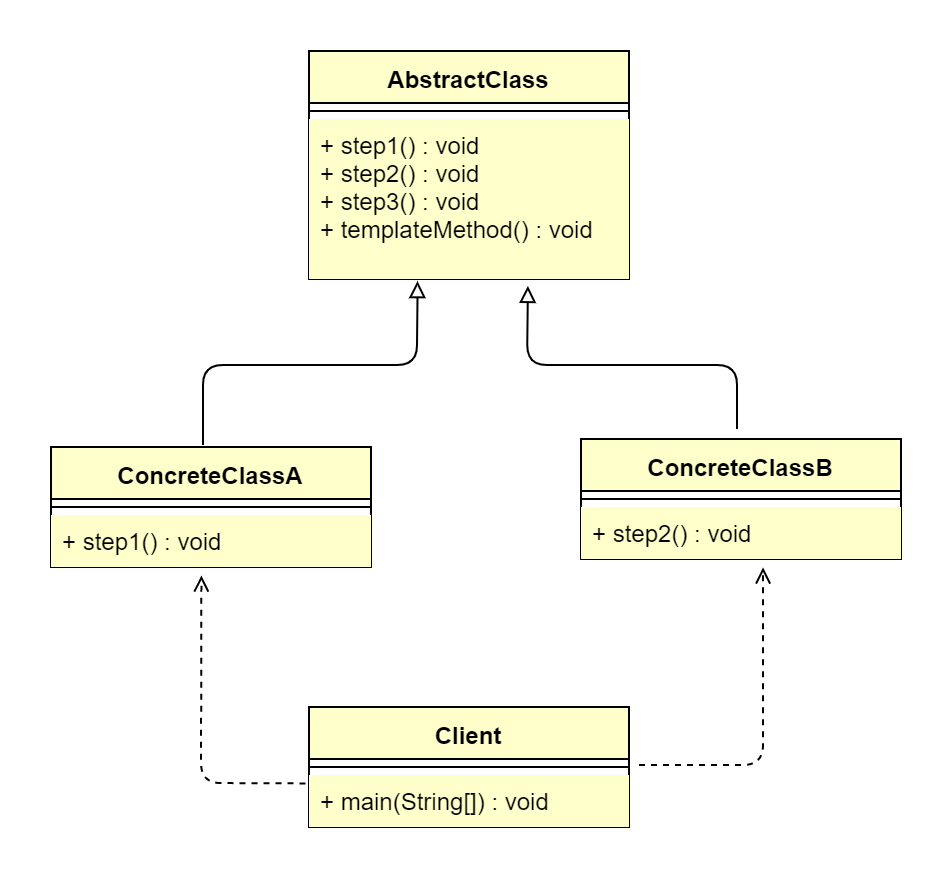

## 1. 模板方法模式概述
### 1.1 模板方法模式的定义
> 模板方法模式（Template Method Pattern）又叫作模板模式，指定义一个操作中的算法的框架，而将一些步骤延迟到子类中，使得子类可以不改变一个算法的结构
> 即可重定义该算法的某些特定步骤，属于行为型设计模式。
>  
> **原文**：Define the skeleton of an algorithm in an operation,deferring some steps to subclasses.Template Method lets subclasses
> redefine certain steps of an algorithm without changing the algorithm's structure.

模板方法模式实际上封装了一个固定流程，该流程由几个步骤组成，具体步骤可以由子类进行不同的实现，从而让固定的流程产生不同的结果。它非常简单，其实就是类的
继承机制，但它却是一个应用非常广泛的模式。模板方法模式的本质是抽象封装流程，具体进行实现。

### 1.2 模板方法模式的应用场景
当完成一个操作具有固定的流程时，由抽象固定流程步骤，具体步骤交给子类进行具体实现（固定的流程，不同的实现）。模板方法模式适用于以下应用场景。
*   一次性实现一个算法的不变的部分，并将可变的行为留给子类来实现。
*   各子类中公共的行为被提取出来，集中到一个公共的父类中，从而避免代码重复。

### 1.3 模板方法模式的 UML 类图

由上图可以看到，模板方法模式主要包含2个角色。
*   抽象模板（AbstractClass）：抽象模板类，定义了一套算法框架/流程。
*   具体实现（ConcreteClass）：具体实现类，对算法框架/流程的某些步骤进行了实现。

## 2. 模板方法模式扩展
### 2.1 模板方法模式的优点
*   利用模板方法将相同处理逻辑的代码放到抽象父类中，可以提高代码的复用性。
*   将不同的算法逻辑分离到不同的子类中，通过对子类的扩展增加新的行为，提高代码的可扩展性。
*   把不变的行为写在父类上，去除子类的重复代码，提供了一个很好的代码复用平台，符合开闭原则。

### 2.2 模板方法模式的缺点
*   每一个抽象类都需要一个子类来实现，这样导致类数量增加。
*   类数量的增加，间接地增加了系统实现的复杂度。
*   由于继承关系自身的缺点，如果父类添加新的抽象方法，则所有子类都要改一遍。