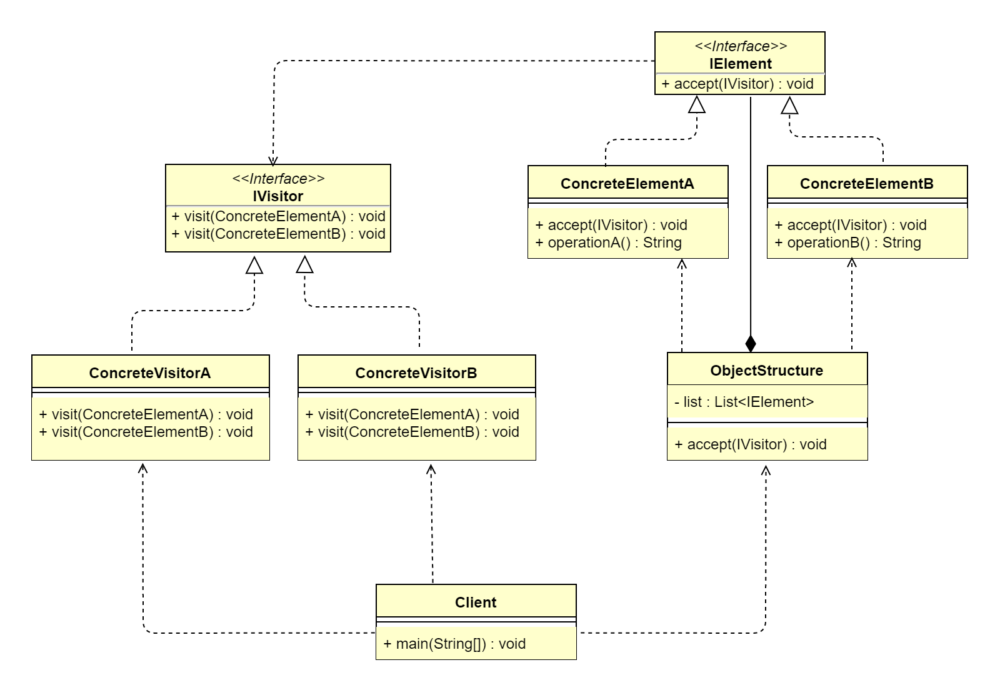

## 1. 访问者模式概述
### 1.1 访问者模式的定义
> 访问者模式（Visitor Pattern）是一种将数据结构与数据操作分离的设计模式，指封装一些作用于某种数据结构中的各元素的操作，可以在不改变数据结构的前提下
> 定义作用于这些元素的新的操作，属于行为型设计模式。
>   
> **原文**：Represent an operation to be performed on the elements of an object structure.Visitor lets you define a new operation
> without changing the classes of the elements on which it operates.
 

&ensp;&ensp;&ensp;&ensp;访问者模式又被称为最复杂的设计模式，并且使用频率不高，《设计模式》的作者这样评价：在大多数情况下，你不需要使用访问者模式，
但是一旦需要使用它，那就是真的需要使用了。**访问者模式的基本思想**是，针对系统中拥有固定类型数的对象结构（元素），在其内提供一个 accept() 方法用来
接收访问者对象的访问。不同的访问者对同一元素的访问内容不同，使得相同的元素集合可以产生不同的数据结果。accept() 方法可以接收不同的访问者对象，然后在内部
将自己（元素）转发到接收到的访问者对象的 visit() 方法内。访问者内部对应类型的 visit() 方法就会得到回调执行，对元素进行操作。也就是通过两次动态分发（
第一次是对访问者分发 accept() 方法，第二次是对元素分发 visit() 方法），最终将一个具体的元素传递到一个具体的访问者。如此一来，就解耦了数据结构与数据
操作，且数据操作不会改变元素状态。**访问者模式的核心**是解耦数据结构与数据操作，使得对元素的操作具备优秀的扩展性。可以通过扩展不同的数据操作类型（访问者）
实现对相同元素集的不同的操作。

### 1.2 访问者模式的应用场景
&ensp;&ensp;&ensp;&ensp;访问者模式在生活场景中的应用是非常多的，例如每年年底的 KPI 考核，KPI 考核标准是相对稳定的，但是参与 KPI 考核的员工可能
每年都会发生变化，那么员工就是访问者。我们平时去食堂或者餐厅吃饭，餐厅的菜单和就餐方式是相对稳定的，但是去餐厅就餐的人员是每天都在发生变化的，因此就餐
人员就是访问者。
&ensp;&ensp;&ensp;&ensp;当系统中存在类型数量稳定（固定）的一类数据结构时，可以通过访问者模式方便地实现对该类型所有数据结构的不同操作，而又不会对
数据产生任何副作用（脏数据）。简而言之，就是当对集合中的不同类型数据（类型数量稳定）进行多种操作时，使用访问者模式。访问者模式主要适用于以下应用场景。
*   数据结构稳定，作用于数据结构的操作经常变化的场景。
*   需要数据结构与数据操作分离的场景。
*   需要对不同数据类型（元素）进行操作，而不是用分支判断具体类型的场景。

### 1.3 访问者模式的 UML 类图

 
由上图可以看到，访问者模式主要包含 5 个角色。
*   抽象访问者（IVisitor）：接口或抽象类，该类定义了一个 visit() 方法用于访问每一个具体的元素，其参数就是具体的元素对象。从理论上来说，IVisitor
    的方法个数与元素个数是相等的。如果元素个数经常变动，则导致 IVisitor 的方法也要进行变动，此时，该情形并不适用于访问者模式。
*   具体访问者（ConcreteVisitor）：实现对具体元素的操作。
*   抽象元素（IElement）：接口或抽象类，定义了一个接受访问者访问的方法 accept()，表示所有元素类型都支持被访问者访问。
*   具体元素（ConcreteElement）：具体元素类型，提供接受访问者的具体实现。通常的实现都为 visitor.visit(this)。
*   结构对象（ObjectStructure）：该类内部维护了元素集合，并提供方法接受访问者对该集合所有元素进行操作。

## 2. 访问者模式扩展
### 2.1 访问者模式的优点
*   解耦了数据结构与数据操作，使得操作集合可以独立变化。
*   可以通过扩展访问者角色，实现对数据集的不同操作，程序扩展性更好。
*   元素具体类型并非单一，访问者均可操作。
*   各角色职责分离，符合单一职责原则。

### 2.2 访问者模式的缺点
*   无法增加元素类型：若系统数据结构对象易于变化，经常有新的数据对象增加进来，则访问者类必须增加对应元素类型的操作，违背了开闭原则。
*   具体元素变更困难：具体元素增加属性、删除属性等操作会导致对应的访问者类需要进行相应的修改，尤其当有大量访问者类时，修改范围太大。
*   违背依赖倒置原则：为了达到“区别对待”，访问者角色依赖的是具体元素类型，而不是抽象。
