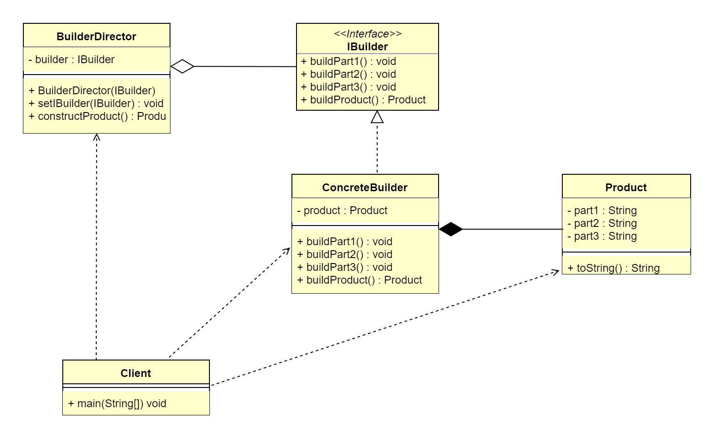

# 1. 建造者模式概述
## 1.1 建造者模式的定义
建造者模式（Builder Pattern）将一个复杂对象的构建过程与它的表示分离，使得同样的构建过程可以创建不同的表示，属于创建型设计模式。

> 原文：Separate the construction of a complex object from its representation so that the same construction process can 
> create different representations.

对于用户而言，使用建造者模式只需指定需要创建的类型就可以获得对象，创建过程及细节不需要了解。根据建造者模式的定义，可以简单地理解为两层含义。

*   构建与表示分离：构建代表对象创建，表示代表对象行为、方法，也就是将对象的创建与行为进行分离（对应到 Java 代码，其实就是使用接口规定行为，然后由
    具体的实现类进行构建）。
*   创建不同的表示：也就是具备同样的行为，但是却由于构建的行为顺序不同或其他原因可以创建出不同的表示。

## 1.2 建造者模式的应用场景
> 从定义来看，建造者模式和工厂模式是非常相似的，和工厂模式一样，具备创建与表示分离的特性。建造者模式唯一区别于工厂模式的是针对复杂对象的创建。也就是说，
> 如果创建简单对象，通常都是使用工厂模式进行创建；而如果创建复杂对象，就可以考虑使用建造者模式。

当需要创建的产品具备复杂创建过程时，可以抽取出共性创建过程，然后交由具体实现类自定义创建流程，使得同样的创建行为可以生产出不同的产品，分离了创建与表示，
使得创建产品的灵活性大大增加。建造者模式主要适用于以下应用场景。
*   相同的方法，不同的执行顺序，产生不同的结果。
*   多个部件或零件，都可以装配到一个对象中，但是产生的结果又不相同。
*   产品类非常复杂，或者产品类中不同的调用顺序产生不同的作用。
*   初始化一个对象特别复杂，参数多，而且很多参数都具有默认值。

## 1.3 建造者模式的UML类图

建造者模式主要包含4个角色。
1.  产品（Product）：要创建的产品类对象。
2.  抽象建造者（IBuilder）：建造者的抽象类，规范产品对象的各个组成部分的创建，一般由子类实现具体的创建过程。
3.  建造者（Concrete Builder）：具体的 Builder 类，根据不同的业务逻辑，具体化对象的各个组成部分的创建。
4.  调用者（Director）：调用具体的建造者，来创建对象的各个部分，在指导者中不涉及具体产品的信息，只负责保证对象各部分完整创建或者按某种顺序创建。

# 2. 建造者模式扩展
## 2.1 建造者模式与工厂模式区别
*   建造者模式更加注重方法的调用顺序，工厂模式注重创建对象。
*   创建对象的力度不同，建造者模式创建复杂的对象，由各种复杂的部件组成，工厂模式创建出来的对象都一样。
*   关注重点不一样，工厂模式只需要把对象创建出来就可以了，而建造者模式不仅要创建出对象，还要知道对象由哪些部件组成。

## 2.2 建造者模式的优点
*   封装性好，构建和表示分离。
*   扩展性好，建造类之间独立，在一定程度上解耦。
*   便于控制细节，建造者可以对创建过程逐步细化，而不对其他模块产生任何影响。

## 2.3 建造者模式的缺点
*   需要多创建一个IBuilder对象。
*   如果产品内部发生变化，则建造者也要同步修改，后期维护成本较大。
