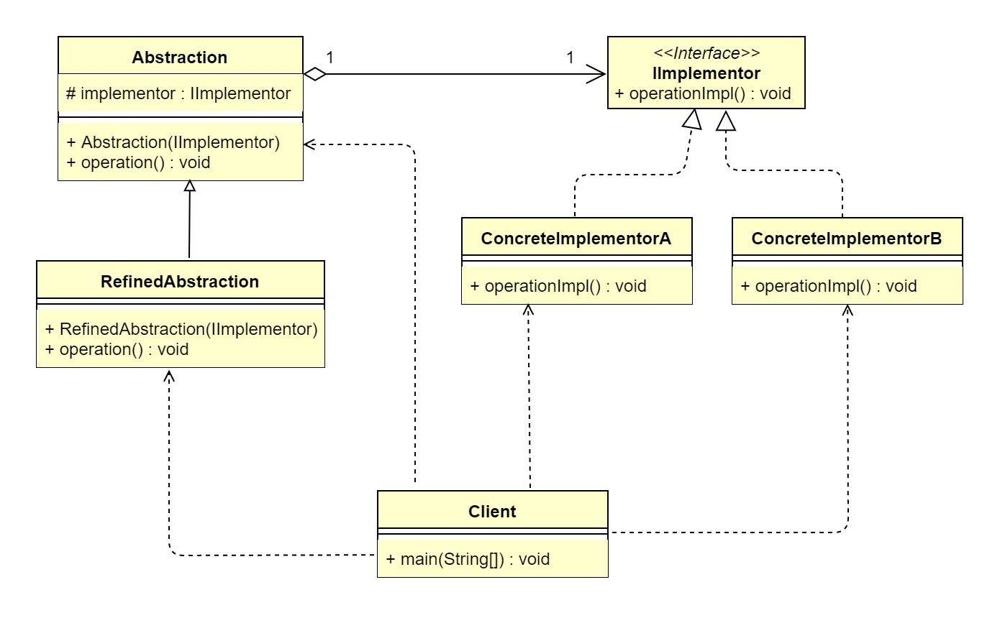

## 1. 桥接模式概述
### 1.1 桥接模式的定义
> 桥接模式（Bridge Pattern）又叫作桥梁模式、接口（Interface）模式或柄体（Handle and Body）模式，指将抽象部分与具体实现部分分离，使它们都可以
> 独立地变化，属于结构型设计模式。

> **原文**：Decouple an abstraction from its implementation so that the two can vary independently.

桥接模式的主要目的是通过组合的方式建立两个类之间的联系，而不是继承，但又类似多重继承方案。但是多重继承方案往往违背了类的单一职责原则，其复用性比较差，
桥接模式是比多重继承方案更好的替代方案。桥接模式的核心在于把抽象与实现解耦。

> **注**：此处的抽象并不是抽象类或接口这种高层概念，实现也不是指继承或接口实现。抽象与实现其实指的是两种独立变化的维度。其中，抽象包含实现，因此，一个抽象
> 类的变化可能涉及多种维度的变化。

### 1.2 桥接模式的应用场景
当一个类内部具备两种或多种变化维度时，使用桥接模式可以解耦这些变化的维度，使高层代码架构稳定。桥接模式适用于以下几种业务场景。
*   在抽象和具体实现之间需要增加更多灵活性的场景。
*   一个类存在两个（或多个）独立变化的维度，而这两个（或多个）维度都需要独立进行扩展。
*   不希望使用继承，或因为多层继承导致系统类的个数剧增。

> **注**：桥接模式的一个常见使用场景就是替换继承。我们知道，继承拥有很多优点，比如，抽象、封装、多态等，父类封装共性，子类实现特性。继承可以很好地实现
> 代码复用（封装）的功能，但这也是继承的一大缺点。因为父类拥有的方法，子类也会继承得到，无论子类需不需要，这说明继承具备强侵入性（父类代码侵入子类），
> 同时会导致子类臃肿。因此，在设计模式中，有一个原则为优先使用组合/聚合，而不是继承。

很多时候，我们分不清该使用继承还是组合/聚合或其他方式等，其实可以从现实语义进行思考。因为软件最终还是提供给现实生活中的人使用的，是服务于人类社会的，软件
是具备现实场景的。当我们从纯代码角度无法看清问题时，现实角度可能会提供更加开阔的思路。

### 1.3 桥接模式的 UML 类图

由上图可以看到，桥接模式主要包含4个角色。
*   抽象（Abstraction）：该类持有一个对实现角色的引用，抽象角色中的方法需要实现角色来实现。抽象角色一般为抽象类（构造函数规定子类要传入一个实现对象）。
*   修正抽象（RefinedAbstration）：Abstraction 的具体实现，对 Abstraction 的方法进行完善和扩展。
*   实现（IImeplementor）：确定实现维度的基本操作，提供给 Abstraction 使用。该类一般为接口或抽象类。
*   具体实现（ConcreteImplementor）：IImeplementor 的具体实现。

## 2. 桥接模式扩展
### 2.1 桥接模式的优点
*   分离抽象部分及其具体实现部分。
*   提高了系统的扩展性。
*   符合开闭原则。
*   符合合成复用原则。

### 2.2 桥接模式的缺点
*   增加了系统的理解与设计难度。
*   需要正确地识别系统中两个独立变化的维度。
