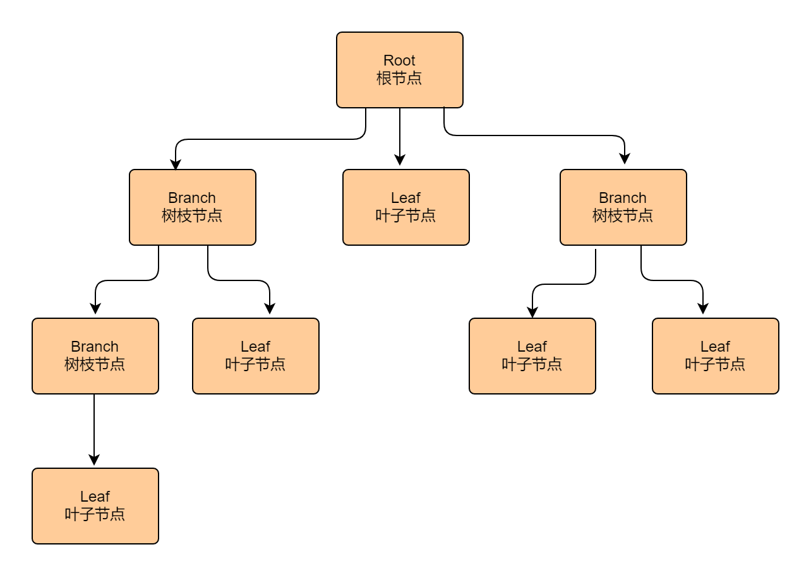

## 1. 组合模式概述
### 1.1 组合模式的定义
> 组合模式（Composite Pattern）又叫作整体-部分（Part-Whole）模式，它的宗旨是通过将单个对象（叶子节点）和组合对象（树枝节点）用相同的接口进行表示，
> 使得客户对单个对象和组合对象的使用具有一致性，属于结构型设计模式。

> **原文**：Compose objects into tree structures to represent part-whole hierarchies.Composite lets clients treat individual 
> objects and compositions of objects uniformly.

组合模式一般用来描述整体与部分的关系，它将对象组织到树形结构中，顶层的节点被称为根节点，根节点下面可以包含树枝节点和叶子节点，树枝节点下面又可以包含树枝
节点和叶子节点，树形结构图如下。

由上图可以看出，其实根节点和树枝节点本质上属于同一种数据类型，可以作为容器使用；而叶子节点与树枝节点在语义上不属于同一种类型。但是在组合模式中，会把树枝
节点和叶子节点看作属于同一种数据类型（用同一接口定义），让它们具备一致行为。这样，在组合模式中，整个树形结构中的对象都属于同一种类型，带来的好处就是用户
不需要辨别是树枝节点还是叶子节点，可以直接进行操作，给用户的使用带来极大的便利。

### 1.2 组合模式的应用场景
当子系统与其内各个对象层次呈树形结构时，可以使用组合模式让子系统内各个对象层次的行为操作具备一致性。当客户端使用该子系统内任意一个对象时，不用进行区分，
直接通用操作即可，非常便捷。
> **注**：如果树形结构系统不使用组合模式进行架构，则按照正常的思维逻辑，对该系统进行职责分析。如上面的树形结构图所示，该系统具备两种对象层次类型：树枝
> 节点和叶子节点。那么我们就需要构造两种对应的类型，由于树枝节点具备容器功能，因此树枝节点内部需维护多个集合存储其他对象层次，例如 List&lt;Composite
> &gt;，List&lt;Leaf&gt;。如果当前系统对象层次更复杂，那么树枝节点就又要增加对应的层次集合，这给树枝节点的构建带来了巨大的复杂性、臃肿性及不可扩展性。
> 同时，当客户端访问该系统层次时，还需进行层次区分，这样才能使用对应的行为，给客户端的使用也带来了巨大的复杂性。而如果使用组合模式构建该系统，由于组合模式
> 抽取了系统各个层次的共性行为，具体层次只要按需实现所需行为即可，这样子系统各个层次就都属于同一种类型，所以树枝节点只需维护一个集合（List&lt;Component
> &gt;）即可存储系统所有层次的内容，并且客户端也不需要区分该系统各个层次的对象，对内系统架构简洁优雅，对外接口精简易用。

**总结一下**，组合模式主要有以下应用场景。
*   希望客户端可以忽略组合对象与单个对象的差异。
*   对象层次具备整体和部分，呈树形结构。

## 2. 组合模式扩展
### 2.1 组合模式的优点
*   清楚地定义各层次的复杂对象，表示对象的全部或部分层次。
*   让客户端忽略了层次的差异，方便对整个层次结构进行控制。
*   简化客户端代码。
*   符合开闭原则。

### 2.2 组合模式的缺点
*   限制类型时会较为复杂。
*   使设计变得更加抽象。
