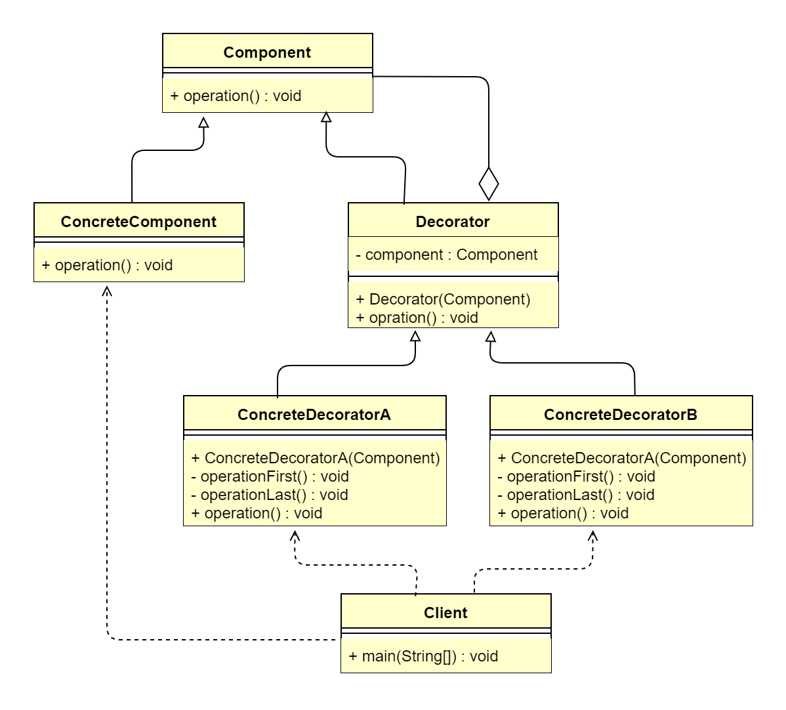

## 1. 装饰器模式概述
### 1.1 装饰器模式的定义
> **装饰器模式**（Decorator Pattern）也叫作包装器模式（Wrapper Pattern），指在不改变原有对象的基础上，动态地给一个对象添加一些额外的职责。就
> 增加功能来说，装饰器模式比生成子类更为灵活，属于结构型设计模式。

> 原文：Attach additional responsibilities to an object dynamically keeping the same interface.Decorators provide a flexible 
> alternative to subclassing for extending functionality.

装饰器模式提供了比继承更有弹性的替代方案（扩展原有对象的功能）将功能附加到对象上。因此，装饰器模式的核心是功能扩展。使用装饰器模式可以透明且动态地扩展类
的功能。

### 1.2 装饰器模式的应用场景
装饰器模式在代码程序中适用于以下应用场景。
*   用于扩展一个类的功能，或者给一个类添加附加职责。
*   动态地给一个对象添加功能，这些功能可以再动态地被撤销。
*   需要为一批平行的兄弟类进行改装或加装功能。

### 1.3 装饰器模式的 UML 类图

装饰器模式主要包含4个角色
*   抽象组件（Component）：可以是一个接口或者抽象类，充当被装饰类的原始对象，规定了被装饰对象的行为。
*   具体组件（ConcreteComponent）：实现/继承 Component 的一个具体对象，即被装饰对象。
*   抽象装饰器（Decorator）：通用的装饰 ConcreteComponent 的装饰器，其内部必然有一个属性指向 Component；其实现一般是一个抽象类，主要为了让其
    子类按照其构造形式传入一个 Component，这是强制的通用行为。如果系统中装饰逻辑单一，则并不需要实现许多装饰器，可以直接省略该类，而直接实现一个具体
    装饰器即可。
*   具体装饰器（ConcreteDecorator）：Decorator 的具体实现类，理论上，每个 ConcreteDecorator 都扩展了 Component 对象的一种功能。

> **总结**：装饰器模式角色分配符合设计模式的里氏替换原则、依赖倒置原则，从而使得其具备很强的扩展性，最终满足开闭原则。

装饰器模式的实现原理是，让装饰器实现与被装饰类（例如 ConcreteComponent）相同的接口（例如 Component），使得装饰器与被装饰类类型一致，并在构造函数
中传入该接口对象，然后在实现这个接口的被包装类对象的现有功能上添加新功能。由于装饰器与被包装类属于同一类型（均为 Component），且构造函数的参数为其实现
接口类（Component），因此装饰器模式具备嵌套扩展功能，这样就能使用装饰器模式一层一层地对底层被包装类进行功能扩展了。

## 2. 装饰器模式扩展
### 2.1 装饰器模式与代理模式的区别
> &ensp;&ensp;&ensp;&ensp;从代理模式的 UML 类图和通用代码实现上看，代理模式与装饰器模式几乎一模一样。代理模式的 Subject 对应装饰器模式的 Component，
> 代理模式的 RealSubject 对应装饰器模式的 ConcreteComponent，代理模式的 Proxy 对应装饰器模式的 Decorator。确实，从代码实现上看，代理模式的确
> 与装饰器模式是一样的（其实装饰器模式就是代理模式的一个特殊应用），但是这两种设计模式所面向的功能扩展是不一样的。 
> &ensp;&ensp;&ensp;&ensp;装饰器模式强调自身功能的扩展。Decorator 所做的就是增强 ConcreteComponent 的功能（也有可能减弱功能），主体对象为
> ConcreteComponent，着重类功能的变化。代理模式强调对代理模式过程的控制。Proxy 完全掌握对 RealSubject 的访问控制，因此，Proxy 可以决定对 RealSubject
> 进行功能扩展、功能缩减甚至功能散失（不调用 RealSubject 方法），主体对象为 Proxy。 
> &ensp;&ensp;&ensp;&ensp;简单来讲，假设现在小明想租房，那么势必会有一些事务发生：房源搜索、联系房东谈价格等。假设按照代理模式进行思考，那么小明
> 只需找到一个房产中介，让他去做房源搜索、联系房东谈价格这些事情，小明只需等待通知然后付中介费就行了。而如果采用装饰器模式进行思考，因为装饰器模式强调
> 的是自身功能扩展，也就是说，如果要找房子，小明自身就要增加房源搜索能力扩展、联系房东谈价格能力扩展，通过相应的装饰器，提升自身能力，一个人做完所有的事情。

### 2.2 装饰器模式的优点
*   装饰器是继承的有力补充，比继承灵活，在不改变原有对象的情况下，动态地给一个对象扩展功能，即插即用。
*   通过使用不同装饰类及这些装饰类的排列组合，可以实现不同效果。
*   装饰器模式完全遵守开闭原则。

### 2.3 装饰器模式的缺点
*   会出现更多的代码、更多的类，增加程序的复杂性。
*   动态装饰在多层装饰时会更复杂。
