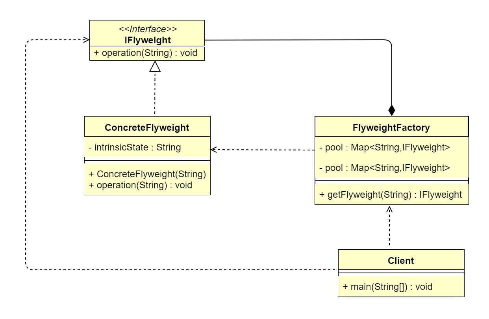

## 1. 享元模式概述
面向对象技术可以很好地解决一些灵活性或可扩展性问题，但在很多情况下需要在系统中增加类和对象的个数。当对象数量太多时，将导致运行代价过高，带来性能下降等
问题。享元模式正是为解决这一类问题而诞生的。
### 1.1 享元模式的定义
> 享元模式（Flyweight Pattern）又叫作轻量级模式，是对象池的一种实现。类似线程池，线程池可以避免不停地创建和销毁多个对象，消耗性能。享元模式提供了
> 减少对象数量从而改善应用所需的对象结构的方式。其宗旨是共享细粒度对象，将多个对同一对象的访问集中起来，不必为每个访问者都创建一个单独的对象，以此来降低
> 内存的消耗，属于结构型设计模式。

> **原文**：Use sharing to support large numbers of fine-grained objects efficiently.

享元模式把一个对象的状态分成内部状态和外部状态，内部状态是不变的，外部状态是变化的；然后通过共享不变的部分，达到减少对象数量并节约内存的目的。享元模式
的本质是缓存共享对象，降低内存消耗。

### 1.2 享元模式的应用场景
&ensp;&ensp;&ensp;&ensp;当系统中多处需要同一组信息时，可以把这些信息封装到一个对象中，然后对该对象进行缓存，这样，一个对象就可以提供给多处需要使用
的地方，避免大量同一对象的多次创建，降低大量内存空间的消耗。享元模式其实是工厂方法模式的一个改进机制，享元模式同样要求创建一个或一组对象，并且就是通过
工厂方法模式生成对象的，只不过享元模式为工厂方法模式增加了缓存这一功能。主要应用场景如下：
*   常应用于系统底层的开发，以便解决系统的性能问题。
*   系统有大量相似对象，需要缓冲池的场景。

### 1.3 享元模式的 UML 类图

由上图可以看到，享元模式主要包含3个角色
*   抽象享元角色（IFlyweight）：享元对象抽象基类或者接口，同时定义出对象的外部状态和内部状态的接口或实现。
*   具体享元角色（ConcreteFlyweight）：实现抽象角色定义的业务。该角色的内部状态处理应该与环境无关，不会出现一个操作改变内部状态，同时修改了外部状态的情况。
*   享元工厂（FlyweightFactory）：负责管理享元对象池和创建享元对象。

## 2. 享元模式扩展
### 2.1 享元模式的内部状态和外部状态
&ensp;&ensp;&ensp;&ensp;享元模式的定义提出了两个要求：细粒度和共享对象。因为要求细粒度，所以不可避免地会使对象数量多且性质相近，此时我们就将这些
对象的信息分为两个部分：内部状态和外部状态。内部状态指对象共享出来的信息，存储在享元对象内部，并且不会随环境的改变而改变；外部状态指对象得以依赖的一个
标记，随环境的改变而改变，不可共享。比如，连接池中的连接对象，保存在连接对象中的用户名、密码、连接URL等信息，在创建对象的时候就设置好了，不会随环境的
改变而改变，这些为内部状态。而当每个连接要被回收利用时，我们需要将它标记为可用状态，这些为外部状态。

### 2.2 享元模式的优点
*   减少对象的创建，降低内存中对象的数量，降低系统的内存，提高效率。
*   减少内存之外的其他资源占用。

### 2.3 享元模式的缺点
*   关注内、外部状态，关注线程安全问题。
*   使系统、程序的逻辑复杂化。
