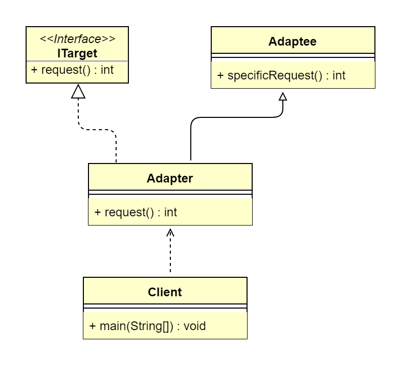
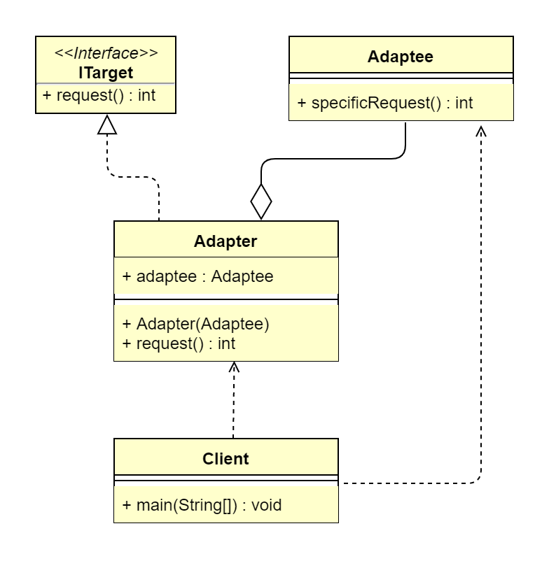
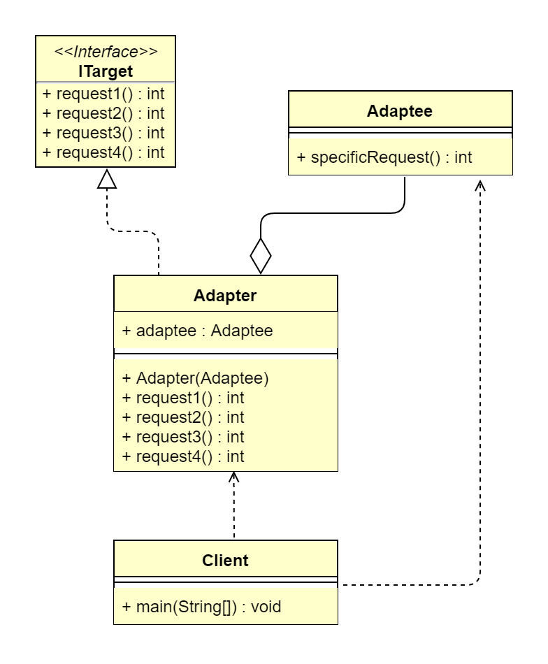

## 1. 适配器模式概述
### 1.1 适配器模式的定义
> 适配器模式（Adapter Pattern）又叫作变压器模式，它的功能是将一个类的接口变成客户端所期望的另一种接口，从而使原本因接口不匹配而导致无法在一起工作的
> 两个类能够一起工作，属于结构型设计模式。

> 原文：Convert the interface of a class into another interface clients expect.Adapter lets classes work together that couldn't
> otherwise because of incompatible interfaces.

> 也就是说，当前系统存在两种接口A和B，客户端只支持访问A接口，但是当前系统没有A接口对象，有B接口对象，而客户端无法识别B接口，因此需要通过一个适配器C，
> 将B接口内容转换成A接口，从而使得客户端能够从A接口获取B接口的内容。

> 在软件开发中，基本上任何问题都可以通过增加一个中间层来解决。适配器模式其实就是一个中间层。综上，适配器模式起着转化/委托的作用，将一种接口转化为另一种
> 符合需求的接口。

### 1.2 适配器模式的应用场景
适配器模式提供一个适配器，将当前系统存在的一个对象转化为客户端能够访问的接口对象。适配器模式适用于以下业务场景。
*   已经存在的类，它的方法和需求不匹配（方法结果相同或相似）的情况。
*   适配器模式不是软件设计阶段考虑的设计模式，是随着软件维护，由于不同产品，不同厂家造成功能类似而接口不相同情况下的解决方案，有种亡羊补牢的感觉。

适配器模式有3种形式：类适配器、对象适配器、接口适配器。适配器模式一般包含3个角色。
*   目标角色（ITarget）：也就是我们期望的接口。
*   源角色（Adaptee）：存在于系统中，是指内容满足客户需求（需转换）但接口不匹配的接口实例。
*   适配器（Adapter）：将 Adaptee 转化为目标角色 ITarget 的类实例。

> 适配器模式各角色之间的关系如下。 
> 假设在当前系统中，客户端需要访问的是 ITarget 接口，但 ITarget 接口没有一个实例符合需求，而 Adaptee 实例符合需求，但是客户端无法直接使用
> Adaptee（接口不兼容）；因此，需要一个 Adapter 来进行中转，使 Adaptee 能转化为 ITarget 接口的形式。

### 1.3 类适配器的 UML 类图及通用写法
类适配器的原理就是通过继承来实现适配器功能。具体做法是，让 Adapter 实现 ITarget 接口，并且继承 Adaptee，这样 Adapter 就具备了 ITarget 和
Adaptee 的特性，可以将两者进行转化。其 UML 类图如下。

### 1.4 对象适配器的 UML 类图及通用写法
对象适配器的原理就是通过组合来实现适配器功能。具体做法是，首先让 Adapter 实现 ITarget 接口，然后内部持有 Adaptee 实例，最后在 ITarget 接口规定
的方法内转换 Adaptee。其 UML 类图如下。

### 1.5 接口适配器的 UML 类图及通用写法
接口适配器的关注点与类适配器、对象适配器的关注点不太一样，类适配器和对象适配器着重于将系统存在的一个角色（Adaptee）转化成目标接口（ITarget）所需的
内容，而接口适配器的使用场景是当接口的方法过多时，如果直接实现接口，则类会多出许多空实现的方法，显得很臃肿。此时，使用接口适配器就能只实现我们需要的接口
方法，使目标更清晰。其 UML 类图如下。

## 2. 使用适配器模式解决实际问题
### 2.1 使用类适配器重构第三方登录自由适配
我们使用类适配器来实现一个实际的业务场景，解决实际问题。年纪稍微大一点的小伙伴一定经历过这样的过程。很早以前开发的老系统应该都有登录接口，但是随着业务
的发展和社会的进步，单纯地依赖用户名和密码登录显然不能满足用户需求。现在，大部分系统都已经支持多种登录方式，如QQ登录、微信登录、手机登录、微博登录等，
同时保留用户名和密码登录的方式。虽然登录形式丰富，但是登录后的处理逻辑可以不必改，都是将登录状态保存到 Session，遵循开闭原则。

## 3. 适配器模式扩展
### 3.1 适配器模式与装饰器模式的区别
> 适配器模式和装饰器模式都是包装器模式（Wrapper Pattern），装饰器模式其实就是一种特殊的代理模式。

对比维度|适配器模式|装饰器模式
:---:|:---:|:---:
形式|没有层级关系|一种非常特别的代理模式，有层级关系
定义|适配器和被适配者没有必然的联系，通常采用继承或代理的形式进行包装|装饰器和被装饰者都实现同一个接口，主要目的是扩展之后依旧保留OOP关系
关系|满足has-a的关系|满足is-a的关系
功能|注重兼容、转换|注重覆盖、扩展
设计|后置考虑|前置考虑

### 3.2 适配器模式的优点
*   能提高类的透明性和复用，但现有的类复用不需要改变。
*   适配器类和原角色类解耦，提供程序的扩展性。
*   在很多业务场景中符合开闭原则。

### 3.3 适配器模式的缺点
*   适配器编写过程需要结合业务场景全面考虑，可能会增加系统的复杂性。
*   增加代码阅读难度，降低代码可读性，过多使用适配器会使系统代码变得凌乱。
