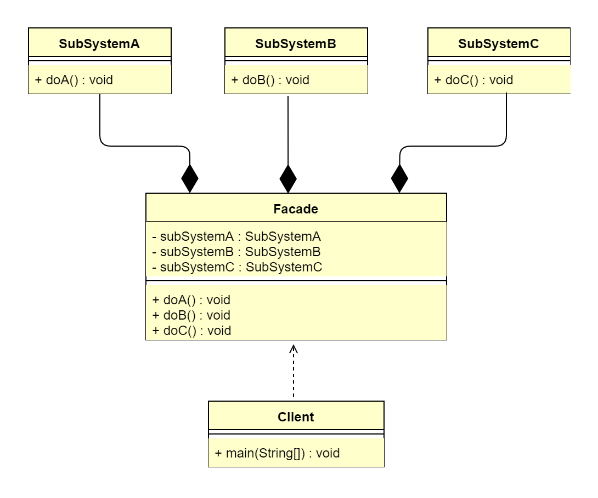

## 1. 门面模式概述
### 1.1 门面模式的定义
> 门面模式（Facade Pattern）又叫作外观模式，提供了一个统一的接口，用来访问子系统中的一群接口。其主要特征是定义了一个高层接口，让子系统更容易使用，
> 属于结构型设计模式。

> **原文**：Provide a unified interface to a set of interfaces in a subsystem. Facade defines a higher-level interface that 
> makes the subsystem easier to use.

&ensp;&ensp;&ensp;&ensp;其实，在日常编码工作中，我们都在有意无意地大量使用门面模式。但凡只要高层模块需要调度多个子系统（2个以上类对象），我们都会
自觉地创建一个新类封装这些子系统，提供精简的接口，让高层模块可以更加容易地间接调用这些子系统的功能。尤其是现阶段各种第三方SDK、开源类库，很大概率都会
使用门面模式。大家觉得调用方便的，一般门面模式使用得更多。

### 1.2 门面模式的应用场景
在软件系统中，门面模式适用于以下应用场景。
*   为一个复杂的模块或子系统提供一个简洁的供外界访问的接口。
*   希望提高子系统的独立性时。
*   当子系统由于不可避免的暂时原因导致可能存在 Bug 或性能相关问题时，可以通过门面模式提供一个高层接口，隔离客户端与子系统的直接交互，预防代码污染。

### 1.3 门面模式的 UML 类图

由上图可以看到，门面模式主要包含2个角色。
*   外观角色（Facade）：也叫作门面角色，是系统对外的统一接口。
*   子系统角色（SubSystem）：可以同时有一个或多个 SubSystem。每个 SubSystem 都不是一个单独的类，而是一个类的集合。SubSystem 并不知道 Facade 
    的存在，对于 SubSystem 而言，Facade 只是另一个客户端而已（即 Facade 对 SubSystem 透明）。

## 2. 门面模式扩展
### 2.1 门面模式的优点
*   简化了调用过程，不用深入了解子系统，以防子系统带来风险。
*   减少系统依赖，松散耦合。
*   更好地划分访问层次，提高了安全性。
*   遵循迪米特法则。

### 2.2 门面模式的缺点
*   当增加子系统和扩展子系统行为时，可能容易带来未知风险。
*   不符合开闭原则。
*   某些情况下，可能违背单一职责原则。
