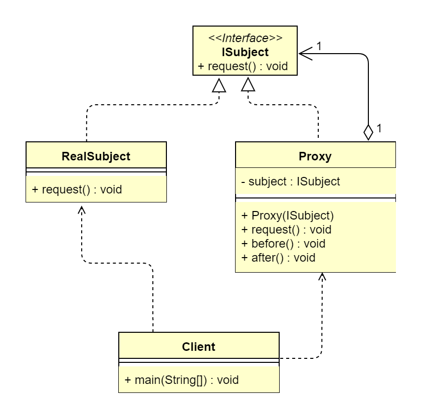

## 1. 代理模式概述
### 1.1 代理模式的定义
> 代理模式（Proxy Pattern）指为其他对象提供一种代理，以控制对这个对象的访问，属于结构型设计模式。  
> **原文**：Provide a surrogate or placeholder for another object to control access to it.  
> &ensp;&ensp;&ensp;&ensp;在某些情况下，一个对象不适合或者不能直接引用另一个对象，而代理对象可以在客户端与目标对象之间起到中介的作用。

### 1.2 代理模式的应用场景
当无法或不想直接引用某个对象或访问某个对象存在困难时，可以通过代理对象来间接访问。使用代理模式主要有两个目的：一是保护目标对象，而是增强目标对象。

### 1.3 代理模式的 UML 类图

 
由上图可以看到，代理模式一般包含3个角色。
*   抽象主题角色（ISubject）：抽象主题类的主要职责是声明真实主题与代理的共同接口方法，该类可以是接口，也可以是抽象类。
*   真实主题角色（RealSubject）：该类也被称为被代理类，该类定义了代理所表示的真实对象，是负责执行系统的真正的逻辑业务对象。
*   代理主题角色（Proxy）：也被称为代理类，其内部持有 RealSubject 的引用，因此具备完全的对 RealSubject 的代理权。客户端调用代理对象的方法，也
    调用被代理对象的方法，但是会在代理对象前后增加一些处理代码。

> 在代码中，一般代理会被理解为代码增强，实际上就是在原代码逻辑前后增加一些代码逻辑，而使调用者无感知。代理模式分为静态代理和动态代理。

## 2. 代理模式扩展
### 2.1 静态代理和动态代理的区别
*   静态代理只能通过手动完成代理操作，如果被代理类增加了新的方法，则代理类需要同步增加，违背开闭原则。
*   动态代理采用在运行时动态生成代码的方式，取消了对被代理类的扩展限制，遵循开闭原则。
*   若动态代理要对目标类的增强逻辑进行扩展，结合策略模式，只需要新增策略类便可完成，无须修改代理类的代码。

### 2.2 代理模式的优点
*   代理模式能将代理对象与真实被调用目标对象分离。
*   在一定程度上降低了系统的耦合性，扩展性好。
*   可以起到保护目标对象的作用。
*   可以增强目标对象的功能。

### 2.3 代理模式的缺点
*   代理模式会造成系统设计中类的数量增加。
*   在客户端和目标对象中增加一个代理对象，会导致处理请求的速度变慢。
*   增加了系统的复杂度。

### 2.4 代理模式的变体
*   防火墙代理。内网通过代理穿透防火墙，实现对公网的访问。
*   缓存代理。比如，当请求图片文件等资源时，先到缓存代理取，如果取到资源则ok，如果取不到资源，再到公网或者数据库取，然后缓存。
*   远程代理。远程对象的本地代表，通过它可以把远程对象当本地对象来调用。远程代理通过网络和真正的远程对象沟通信息。
*   同步代理。主要使用在多线程编程中，完成多线程间同步工作。

### 2.5 CGLib 和 JDK 动态代理对比分析
*   JDK 动态代理实现了被代理对象的接口，CGLib 动态代理继承了被代理对象。
*   JDK 动态代理和 CGLib 动态代理都在运行期生成字节码，JDK 动态代理直接写 Class 字节码，CGLib 动态代理使用 ASM 框架写 Class 字节码。CGLib
    动态代理实现更复杂，生成代理类比 JDK 动态代理效率低。
*   JDK 动态代理调用代理方法是通过反射机制调用的，CGLib 动态代理是通过 FastClass 机制直接调用方法的，CGLib 动态代理的执行效率更高。